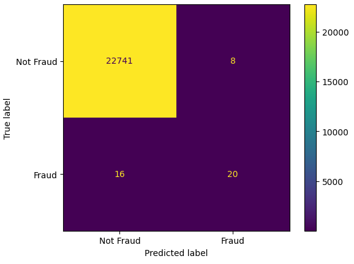

# binary-classification-metrics

In this repository we build a binary classification model using Logestic Regression, and use different binary classification metrics to have a better understanding of them.

## How to use

## Dataset:

- https://www.kaggle.com/datasets/mlg-ulb/creditcardfraud

- Go to your kaggle account --> Your profile --> Settings --> API --> Create New Token.

A json file (kaggle.json) will be downloaded automatically. Upload it in colab/files

## Logestic Regression

## Binary Classification Metrics

- **confusion matrix:** A **confusion matrix** is a tabular summary that helps evaluate the performance of a **classification model**. Let's break it down:

- It summarizes the number of **correct** and **incorrect** predictions made by the model.
- The matrix is especially useful for assessing classification models beyond basic accuracy metrics.
- Here's how it works:

  - **True Positives (TP)**: These occur when the model accurately predicts a **positive** data point.
  - **True Negatives (TN)**: These occur when the model accurately predicts a **negative** data point.
  - **False Positives (FP)**: These occur when the model predicts a **positive** data point incorrectly.
  - **False Negatives (FN)**: These occur when the model mispredicts a **negative** data point.

- The confusion matrix helps us calculate various performance metrics like:
  - **Accuracy**: The ratio of total correct instances to the total instances.
  - **Precision**: The proportion of true positive predictions among all positive predictions.
  - **Recall (Sensitivity)**: The proportion of true positive predictions among all actual positive instances.
  - **F1-score**: A harmonic mean of precision and recall.
 

