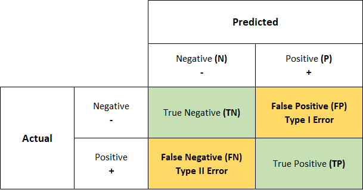
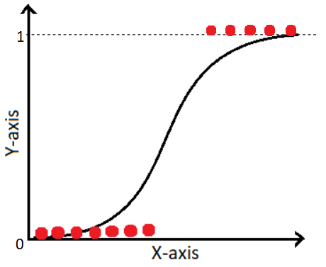

# binary-classification-metrics

In this repository we build a binary classification model using Logestic Regression, and use different binary classification metrics to have a better understanding of them.

## How to use

## Dataset:

- https://www.kaggle.com/datasets/mlg-ulb/creditcardfraud

- Go to your kaggle account --> Your profile --> Settings --> API --> Create New Token.

A json file (kaggle.json) will be downloaded automatically. Upload it in colab/files

## Binary Classification Metrics

- **confusion matrix:** A **confusion matrix** is a tabular summary that helps evaluate the performance of a **classification model**. Let's break it down:

- It summarizes the number of **correct** and **incorrect** predictions made by the model.
- The matrix is especially useful for assessing classification models beyond basic accuracy metrics.
- Here's how it works:

  - **True Positives (TP)**: These occur when the model accurately predicts a **positive** data point.
  - **True Negatives (TN)**: These occur when the model accurately predicts a **negative** data point.
  - **False Positives (FP)**: These occur when the model predicts a **positive** data point incorrectly.
  - **False Negatives (FN)**: These occur when the model mispredicts a **negative** data point.

Using confusion matrix we can calculate the following performance metrics.

Most Common Metrics:

  - **Accuracy**: The ratio of total correct instances to the total instances.
 
    $Accuracy$ =  $\frac{TP + TN}{TP + TN + FP + FN}$
  - **Precision**: The proportion of true positive predictions among all positive predictions.
  
    $Precision$ = $Positive$ $Predictive$ $Value$ = $\frac{TP}{TP + FP}$
  
  - **Recall (Sensitivity)**: The proportion of true positive predictions among all actual positive instances.
  
    $Recall$ = $Sensitivity$ = $True$ $Positive$ $Rate$ = $\frac{TP}{TP + FN}$
  
  - **F1-score**: A harmonic mean of precision and recall.
    
    $F1$ = $\frac{2 \times Precisicion \times Recall}{TP + FN}$

Less Common Metrics:

    
  - $Specificity$ = $True$ $Negative$ $Rate$ = $\frac{TN}{TN + FP}$

  - $False$ $Negative$ $Rate$ = $\frac{FN}{TP + FN}$

  - $False$ $Positive$ $Rate$ = $\frac{FP}{TN + FP}$

  - $Negative$ $Predictive$ $Value$ = $\frac{TN}{TN + FN}$

  - $Balanced$ $Accuracy$ = $\frac{(TPR + TNR)}{2}$

  - $Matthews$ $Correlation$ $Coefficient$ = $\frac{(TP * TN) - (FP * FN)}{\sqrt{(TP + FP) * (TP + FN) * (TN + FP) * (TN + FN)}}$

 Confusion matrix is a powerful tool for understanding how well your model is performing!

 
## Logestic Regression
**Logistic regression** is a powerful technique used in machine learning for **classification tasks**.

1. **What is Logistic Regression?**
   - https://www.youtube.com/watch?v=yIYKR4sgzI8    
   - Logistic regression predicts the output of a **categorical dependent variable** (e.g., Yes/No, 0/1, True/False).
   - Instead of giving exact values like 0 or 1, it provides **probabilistic values** between 0 and 1.
   - It's an extension of linear regression, mainly used for **classification problems**.
   - The goal is to predict the **probability** that an instance belongs to a given class.

2. **Logistic Function (Sigmoid Function):**

   - The sigmoid function maps real values to probabilities within the range of 0 and 1.
   - It forms an **"S" shaped curve** and ensures the output stays within the valid probability bounds.
   - The threshold value (usually 0.5) determines whether an instance belongs to Class 0 or Class 1.

3. **Types of Logistic Regression:**
   - **Binomial**: Only two possible dependent variable types (e.g., Pass/Fail).
   - **Multinomial**: Three or more possible unordered dependent variable types (e.g., "cat," "dogs," "sheep").
   - **Ordinal**: Three or more possible ordered dependent variable types (e.g., "low," "Medium," "High").
